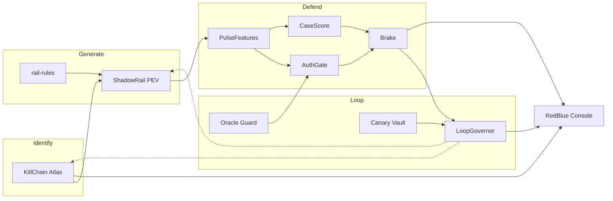

# AI Defense Lab — System Architecture

Mastercard Innovation Challenge @ GFF 2026 · Identify → Generate → Defend

**Product.** A closed-loop lab that catalogs GenAI-powered payment attacks, simulates them at payment fidelity on a synthetic rail, scores them like an issuer/network decisioning service, applies a mitigation policy, and retrains only when an independent holdout still agrees.

This document is the architecture spec. Taxonomy lock lives in `decisions.md`. Problem statement: `MC_PS.md`. Landscape: `HACKATHON_RESEARCH.md`. **Defend detail + gates:** `defense_architecture.md`. **Loops:** `feedback-loop.md`.

---

## 1. One-sentence design

**KillChain Atlas** catalogs attacks → **ShadowRail** simulates them → **AuthGate** scores the payment in tens-to-hundreds of ms → **Brake** chooses an action → **LoopGovernor** promotes a new model only if **Canary Vault** does not get worse.

That is the PS: the attacks you generate train and stress-test the defense; the gaps the defense reveals become new attack tickets — under live-payments constraints (latency, false positives, APP vs stolen-credential, no criminal tooling).

---

## 2. Locked vs amended

### Keep (`decisions.md` Part A)

- 24 techniques grouped into **5** generators (not 24 pipelines).
- Generate pattern: **LLM proposer → deterministic engine → verifier** (accept or reject-and-repair).
- Graph **features**, not a GNN.
- One AutoML **family** (AutoGluon / FLAML), not a novel net.
- Cat 4 **is the loop**, not a fifth detector.
- Cat 5 reuses Cat 2’s engine (fields only, no images).

### Amendments (council: payments, CISO, adversarial ML, LangGraph)

These are required for “real-world feasibility in live payments.” They refine A3; they do not reopen the five categories.

| Hole in a naive reading of A3 | Amendment |
| ----------------------------- | --------- |
| One AutoML blob on one wide table at “pay time” | Two-speed Defend: **AuthGate** (causal, compact) + **CaseScore** (batch/case). Same AutoML family, different feature **views**. |
| Detect without mitigate | **Brake** policy: allow / notify / step-up / hold / decline / mule-credit-restrict. |
| Loop trains on the same generator | **G-train / G-dev / frozen G-test (family B)** + real-proxy holdouts. Never report metrics on the batch you just oversampled. |
| Cat 4 unbounded score API | Offline Cat 4, **Oracle Guard**, query cap, feature mask. |
| Dialogue embeddings at UPI auth | Auth uses **session flags**. Full scripts are Generate fidelity + CaseScore. |
| PageRank on the finished graph | Causal **G(t−)** ego windows + stale batch mule prestige. |
| One `is_fraud` | Labels: `economic_class` + `rail` + lagged outcome. APP ≠ stolen-card. |
| “One dataset schema” as one dense frame | Thin **canonical envelope** + typed payloads + feature views. Illegal co-occurrence (GSTIN + 3DS + VPA + transcript embed on every row) is forbidden. |

---

## 3. Control plane



Dashed edges are the closed loop: tickets and oversample quotas, not live money movement.

---

## 4. Named components

| Component | Pillar | Responsibility |
| --------- | ------ | -------------- |
| **KillChain Atlas** | Identify | Machine-readable 24-vector KB: rail, kill-chain stage, GenAI modality, generate vs name-only, dual-use rating, status `open / generating / defending / solved / rejected_unsafe`. |
| **ShadowRail** | Generate | Air-gapped proposer → engine → verifier. Synthetic namespace only. No NPCI, issuer host, or production payment APIs. |
| **rail-rules** | Generate | Deterministic UPI / IMPS / card-sim invariants. **Only code** may accept a sample. |
| **PulseFeatures** | Defend | Two views, same code offline and “serving”: `features_auth` vs `features_case`. Causal as-of `t`. |
| **AuthGate** | Defend | Distilled tabular champion (FLAML / single GBDT). Reason codes. p99 inside a 50–300 ms story. |
| **CaseScore** | Defend | Slow path: windowed graph, identity seasoning, Cat 3 text, Cat 5 fields. Analysts and disputes. |
| **Brake** | Mitigate | Maps scores + reason codes → policy action. This is the product, not the class label. |
| **Oracle Guard** | Safety | Caps Cat 4 score queries. Quantized demo scores. No ensemble weights in the browser. |
| **LoopGovernor** | Loop | Batch misses → human gate → oversample → challenger fit → canary → promote or reject. |
| **Canary Vault** | Eval | Frozen G-test + SAML-D / BAF / ATO-proxy. Never in the oversample path. |
| **RedBlue Console** | UI | Taxonomy board, loop timeline, rail inspector, HITL queue. Not a scam chatbot. |

---

## 5. Identify

### 5.1 Job

Exhaustive **catalog**, not 24 generation pipelines. Diversity score = coverage of **lifecycle × rail × economic class**. Mastercard + GFF: **name** card / 3DS / network vectors even if Generate stays UPI-structured.

Each Atlas row:

- `technique_id`, umbrella `category` 1–5
- `lifecycle_stage`, `rail` (`upi` / `imps` / `neft` / `rtgs` / `card`)
- `genai_modality`, `control_failed`
- `economic_class` (APP / ATO / CNP / mule / BEC / detector)
- `generate` vs `name_only`
- `dual_use_rating`, citations into a **local** corpus (FinCEN, RBI notes, papers, SAML-D codebook)
- `feature_contract` (which PulseFeatures columns should fire)

Identify tools: `kb_search`, `kb_get_chunk`, `upsert_taxonomy`. **No** live web scrape of criminal markets.

### 5.2 Lifecycle map (name even if not generated)

| Stage | Generate | Name-only (still counts for diversity) |
| ----- | -------- | -------------------------------------- |
| KYC / onboarding | Cat 2 structured trajectories | Deepfake / liveness **methods** as FinCEN-style flags; KYC-vendor LLM compromise |
| ATO | Cat 2 velocity / device | SIM-swap assisted by social scripts; live MFA-relay **as a class** (not a named tool in the public repo) |
| Initiation | Cat 1, 3, 5 fields | CNP + 3DS social engineering; QR overlay; refund-to-wrong-VPA; agentic checkout |
| Authorization | Featurized subset of 1–3 | Token misuse, BIN testing — name the gap if the hackathon cannot have network-scale features |
| Clearing / settlement | Cat 1 hops in sim time | Nested PSP, cross-border last mile |
| Mule cash-out | Cat 1 fan-out + TTL | Cash / crypto / gaming sinks (taxonomy, not live rails) |
| Dispute / SAR | Cat 5 field records | Friendly fraud; fabricated card evidence (fields only) |

### 5.3 24 techniques → 5 engines

| Cat | Generated parameter packs | Identify extras |
| --- | ------------------------- | --------------- |
| **1 Network** | Mule fan-in/out, cap smurfing, UPI↔IMPS↔wallet hops, dust/layering, synthetic merchant collusion | Off-ramps, nested PSP, mule-as-a-service |
| **2 Identity** | Synthetic ID fields, ~150d seasoning, ATO | Deepfake VKYC described; vendor supply-chain |
| **3 Social / APP** | Multi-turn Hinglish (offline/templated), persuasion labels, session flags, linked payment | Voice-clone BEC, polymorphic phishing, invoice-timed impersonation, live MFA-relay class |
| **4 Loop** | Masked JSON patch vs frozen AuthGate | Poisoning, fingerprinting, merchant-bot injection, agentic payment (tag Cat 3∩4) |
| **5 Document** | Invoice / beneficiary fields via Cat 2 engine | Chargeback-pack forgery as a **separate** typology from GST checksums |

Cat 3 public output: labeled simulation transcripts + technique tags, **not** operator playbooks.

---

## 6. Generate

### 6.1 Pattern (all categories)

```
LLM proposer (structured JSON)
        → deterministic engine (rules / graph / daily loop)
        → verifier (code first; LLM judge only for Cat 3 language)
        → accept | reject-and-repair (bounded)
```

Realism comes from **domain rules + personas + verifier loops**, not from copying production rows. Calibrate Cat 1 from **SAML-D aggregates**, never row copy.

### 6.2 Agentic thickness

| Cat | LLM | Engine | Notes |
| --- | --- | ------ | ----- |
| 1 | Thin: typology params only | Graph: topology, balances, caps | Do not let an LLM emit the edge list |
| 2 | Strong: persona / `next_prompt` | Daily state `s_t`, seasoning → burst | Structured repair on rule violation |
| 3 | Strong: planner + attacker | Attach payment + biometric flags | Victim **resistance policy** is a state machine, not a tool-using helper |
| 4 | Strong: allowlisted JSON patch | Apply + feature mask + `query_automl` | Gated until `model_artifact_id` exists; offline |
| 5 | Minimal: narrative fields | Reuse Cat 2 validators | PAN/GSTIN/amount in **code** |

### 6.3 Orchestration (LangGraph)

- **Parent `closed_loop`:** sequential StateGraph (Identify → Generate → Defend → Control). No swarm. Cat 4 subgraph uncompiled until a champion exists.
- **Identify:** router + parallel specialists (taxonomy curator, novelty scorer, rail-grounding critic) + deterministic schema gate + HITL promote.
- **Generate:** evaluator-optimizer with the **engine as a node**, not two LLMs.
- **Defend:** deterministic featurize / fit / predict. AutoML is a **tool**, never SQL/shell.
- **Persistence:** checkpointer = one demo `thread_id`; Store = Atlas KB across runs.
- **HITL interrupts:** promote taxonomy, approve retrain, reject `rejected_unsafe`.

References: [LangGraph overview](https://docs.langchain.com/oss/python/langgraph/overview) (mix deterministic + agentic nodes), [evaluator-optimizer](https://docs.langchain.com/oss/python/langgraph/workflows-agents), [subagents](https://docs.langchain.com/oss/python/langchain/multi-agent/subagents), [HITL](https://docs.langchain.com/oss/python/langchain/human-in-the-loop), [checkpointers](https://docs.langchain.com/oss/python/langgraph/checkpointers).

### 6.4 Fidelity contract (payments)

- **Rails are typed.** Do not put VPA + MCC + 3DS + chargeback on every row. UPI is instant credit-push; card has auth → clearing → dispute. IMPS is a hop rail when UPI is limited.
- **Amounts are mixtures.** Kirana small-ticket, salary calendar, ₹1 probes, smurfs **just under product caps** — not `Uniform(1, 1e5)`.
- **APP vs stolen-credential.** APP: known device, OTP/biometric succeeded, new/mule payee, session coercion flags. ATO/CNP: new device, testing, 3DS fail, cardholder did not intend.
- **Mules have TTL.** Fan-out, cash-out sinks, replacement — not immortal star graphs.
- **Cat 5 BEC.** Genuine GSTIN/PAN and tax math; **beneficiary / lookalike domain** change. Checksums catch amateur fakes only.
- **Benign world first.** Fraud is a constrained perturbation of a realistic baseline (circadian spend, stable payees).

Internal schema: `gff.txn.v1`. Reserved synthetic IDs (`VID-SIM-…`). Not wire-compatible UPI XML / ISO-8583.

### 6.5 Canonical envelope (thin shared schema)

Every event has: `event_id`, `event_ts`, `rail`, `party_ids`, `amount_minor`, `currency`, `label_class`, `label_ts`.

Typed payloads hang off the envelope. Feature views:

- `features_auth` — causal, production-available
- `features_onboarding`
- `features_graph_asof`
- `features_dispute`

AutoML trains **per view** (or one model with `view_id` and hard null-masking that matches serving).

Suggested field names (no real PII): `kyc_tier`, `seasoning_days`, `device_hash`, `copy_paste_payee_flag`, `pause_ms`, `call_active_flag`, `upi_mode`, `card_entry_mode`, `3ds_status`, `payee_in_degree_1d`, `fan_in_ratio_24h`, `burst_velocity`, `pagerank_batch` (batch only), `beneficiary_changed`, `days_since_beneficiary_change`, `policy_action`, `explain_codes`.

---

## 7. Defend

### 7.1 Two planes, one AutoML family

Authorization is a **latency + feature** problem. AutoGluon `best_quality` is the **offline challenger**. The on-path champion is a distilled / FLAML / single-model scorer.

| Plane | Budget | Inputs | Output |
| ----- | ------ | ------ | ------ |
| **AuthGate** | 50–300 ms story | Velocity as-of t, new payee, session flags, **stale** payee/mule risk | Score, calibrated p, reason codes |
| **CaseScore** | Seconds–batch | Windowed graph, seasoning, Cat 3 text (if any), Cat 5 | Case priority, typology, dispute lock |

Do **not** concatenate raw 384-d sentence embeddings into AutoGluon. If text is used at all on-path, use a handful of **probe scores**. Full dialogue is investigation.

### 7.2 Causal graph features

For transaction *i* at time *t*:

- Snapshot `G(t−)` = posted txns with `time < t`.
- Ego window: 1–2 hops, τ ∈ {1h, 24h, 7d}.
- Features: in/out degree, fan-in/out **in window**, burst, local clustering on the **windowed** subgraph.
- Prestige: **batch** personalized PageRank from previously risked mule seeds, read as a **stale** node attribute — never PageRank on the completed simulation.

Leakage test: recompute with full graph vs `G(t−)`. If AUC collapses, training was cheating. Split by time / component, not random rows on a graph.

### 7.3 Cat 3 task split

- **Auth label:** coerced / APP-risk payment **in progress**. Features: call-in-progress, paste-on-payee, pause, new payee, amount vs history.
- **Generate / investigation:** full script + persuasion labels. Report two numbers; do not mix.

Live MFA-relay (named in taxonomy): signal is simultaneous session + call + payee change + OTP timing — not “transcript looks like a scam.”

### 7.4 Brake (mitigation)

| Band | Auth-time action | Do not |
| ---- | ---------------- | ------ |
| Low | Allow | Experiment on genuine kirana/rent |
| APP elevated | Notify + optional Yes/timeout; step-up on new VPA | Silent hard decline of known payee |
| High victim-side | Hold / lagged credit (high-value new payee) | Treat UPI as card chargeback |
| High ATO / CNP | Decline / 3DS / session kill | Mix with APP labels |
| Mule payee | Restrict **credit**: cap, freeze fan-in | Only score the sender |

Mastercard-shaped analog: network/issuer **score + reason codes** → issuer policy → mule intelligence on the credit side.

### 7.5 Cat 4 (the loop, not a fifth model)

Partition columns:

- `X_adv` — attacker-mutable under budget (amount jitter, mule payee among owned accounts, device rotate).
- `X_env` — bank-computed, frozen (account age, batch PPR, historical velocity).
- `X_forbidden` — generator IDs, full-graph stats, future edges, post-auth transcripts.

Patches apply **only** to `X_adv`, then **rail-rules**. Report evasion only on verifier-accepted rows.

Use **both**: constrained tabular attacks (TabAttackBench-style, projected onto valid domain) as a lower bound, and LLM JSON patches as the primary story. Cap queries (Oracle Guard). Never return SHAP/trees to the attacker.

### 7.6 Metrics (order of appearance in the write-up)

1. PR-AUC / average precision, **by typology** (APP, mule component, ATO, CNP, BEC).
2. TPR at FPR 0.1% / 0.5% / 1%; precision at a review-capacity operating point.
3. Rupee cost: missed fraud vs false friction (step-up cheaper than decline).
4. Calibration (ECE) if you show a 0–1000 score.
5. AuthGate p50/p99 latency (champion, not the AutoGluon stack).
6. Cat 4: verifier-accepted evasion vs query budget; **post-retrain PR-AUC on frozen G-test**.
7. Cat 3: Cohen’s κ vs blinded native speakers; LLM-as-judge secondary. No India holdout → **do not lead with AUC**.
8. Entity-level mule recall (catch the account/component, not only the last edge).

Never: accuracy or F1 on a balanced MoMTSim-like mix; 99.9% with no FPR story.

---

## 8. Closed loop (science, not a self-licking ice cream)

```
Atlas (hypotheses, citations)
    → ShadowRail family A → G-train → fit champion M*
    → family A new seeds → G-dev → Cat 4 search, thresholds
    → family B / frozen engine → G-test  }  reported metrics
    → SAML-D / TransXion / BAF          }  promotion gate
    → LoopGovernor: verified evasions into G-train only (mix cap, e.g. ≤15%)
    → challenger M' vs M* on Canary Vault
    → promote or reject; mark solved only on G-test stability
```

**Forbidden:** same generator + random 80/20 as “holdout”; adding Cat 4 wins to G-test; training on `generator_id` / `persona_id` / `patch_round`; auto-`solved` from ROC lift on G-dev.

**Poisoning controls:** verifier admission; trust tiers (`human_gold` / `synth_verified` / `loop_evasion`); canary veto if real-proxy FPR jumps; near-dup caps so one evasion is not 10×’d; Identify tickets need citation + rail constraint.

`solved` means: ≥2 Cat 4 rounds with stable G-test, no real-proxy degradation, typology transfer (a Cat 1 patch is not credited as a Cat 3 win).

---

## 9. Safety and dual-use

MUST:

1. No live rails, real customers, real VPA/PAN/Aadhaar payloads.
2. No images, audio, APKs, outbound phishing.
3. ShadowRail: allowlisted model endpoints only; LLM keys **server-side**; spend caps.
4. All generator inputs (KB, misses, demo text) treated as **untrusted**. Output = schema. Verifier is code.
5. Cat 4 offline, not in the public prototype.
6. Loop cannot promote without canary + human.
7. Public repo: capability-limited dialogues; `SECURITY.md` / capability card; CI grep for live URLs and ID-shaped strings.
8. Identify may be exhaustive; Generate is **capability-limited**.

Web prototype threat model: unauthenticated generate endpoints, keys in the browser, unbounded LLM spend — all disallowed.

---

## 10. RedBlue Console (submission UI)

Judges must **see the loop**, not a CSV classifier.

1. **Threat map** — 24 techniques in 5 columns; chips `open / generating / defending / solved`; evidence spans from local KB.
2. **Simulation console** — launch a campaign; inspect synthetic ledger + mule graph (schema-valid rows).
3. **Decisioning** — score stream, reason codes, **Brake action** (not binary only).
4. **Arms race** — static blue vs looped blue on **frozen G-test**; evasion vs round.
5. **HITL queue** — promote taxonomy, approve retrain, reject unsafe drafts.
6. **Analyst copilot** — summarize a case. LLM is **not** the detector.

Demo thread is checkpointed so judges can replay.

---

## 11. Evaluation protocol (by category)

| Cat | Train | Eval | Guardrail |
| --- | ----- | ---- | --------- |
| 1 | Synth graphs (SAML-D **aggregates** only) | SAML-D, TransXion (map typologies; drop FX if needed), MoMTSim **recalibrated** (toy prior) | Entity-disjoint; report transfer drop; do not claim “this is UPI production” |
| 2 | Synth seasoning | BAF + injected ATO proxies | State: no India Stack in BAF |
| 3 | Own Hinglish scripts | Blinded native-speaker + LLM-judge; Western corpora as language ablation only | No AUC-as-headline |
| 4 | After blue v1 | Masked, verifier-accepted evasion vs round | No FGSM on fields the attacker cannot set |
| 5 | Synth invoices | Expert red-team + **beneficiary-change** cases that pass checksums | Do not cite DGGI stats as labels |

Some holdout names in `decisions.md` Part C are still unverified — confirm links before citing in the .docx.

---

## 12. Build order

| Step | Ship | Gate |
| ---- | ---- | ---- |
| 0 | Atlas schema + rail-rules + synthetic namespace | No live rail message types |
| 1 | Benign world model | Payments review of amount / rail mix |
| 2 | Cat 2 identity engine (feeds Cat 5) | Reserved IDs only |
| 3 | Cat 1 graph engine + causal PulseFeatures | Leakage test: full-graph AUC must collapse |
| 4 | Cat 3 dialogue **offline** + auth session flags | Two reported numbers, not mixed |
| 5 | AuthGate + Brake + Console | p99 + policy actions visible |
| 6 | Cat 4 offline vs frozen champion | Oracle Guard + G-test non-degradation |
| 7 | Cat 5 beneficiary-change | Do not claim checksum = BEC |

Matches `decisions.md` B1.3 with council gates inserted.

---

## 13. Over-agenting (do not build)

- Identify swarm that browses the open web.
- Cat 1 as a ReAct graph builder.
- Cat 5 document “crew” inventing letterheads.
- Defend agent that chats AutoGluon hyperparameters.
- LLM wrapper around every verifier.
- Cat 3 victim with tools (leaks the detector).
- Orchestrator LLM that freely reorders Identify / Generate / Defend.

Keep LLMs where the problem is **strategic**: identity trajectories, multi-turn social engineering under a resistance policy, Cat 4 patches, Identify curation against a local corpus. Everywhere else LangGraph’s value is checkpoints, interrupts, structured tools, and evaluator-optimizer edges.

---

## 14. Feasibility one-pager for judges

- **Latency:** GenAI off the authorization path. On-path = compact tabular + precomputed features.
- **APP:** customer-authorized payments need hold / warn / trusted-person, not only decline.
- **Graph:** mule networks are invisible one txn at a time; features are causal and stale-batch, not a GNN at 50 ms.
- **Governance:** auto-retrain is a **lab** with LoopGovernor; production would be champion–challenger + model-risk. Say that out loud.
- **Ethics:** synthetic personas, no deepfakes of living people, no dark-web tooling.
- **Explainability:** reason codes + red-flag overlay beside AutoML.

Deck lines:

- Generate: *One verification architecture, variable agent thickness — matched to what each fraud type requires for fidelity.*
- Defend: *One AutoML family, two feature views, a policy head — matched to what each rail exposes at payment time.*
- Loop: *The loop cannot grade its own homework.*

---

## 15. Sources

- `MC_PS.md`, `decisions.md`, `HACKATHON_RESEARCH.md`
- Kurshan, Mehta, Bruss, Balch — [AI versus AI in Financial Crimes and Detection](https://arxiv.org/abs/2410.09066)
- FinCEN FIN-2024-Alert004 (red flags → features / rules, not exploits)
- LangChain LangGraph docs cited in §6.3

Attack content in this repo is **taxonomy-level**. No exploit procedures, phishing kits, or live tooling.
