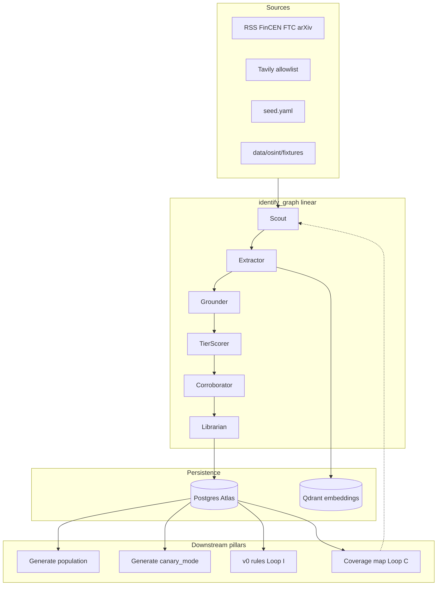

---

name: Final Identify Plan Doc

overview: Create `final identify plan.md` as the single implementer-facing Identify guide, reconciling the old identify pipeline docs with locked plans 00–03 and the defence architecture (Defend handoff, Loop C/I, coverage map).

todos:

  - id: draft-final-identify-plan

    content: Write final identify [plan.md](http://plan.md) with all 16 sections, diagrams, and reconciled terminology

    status: pending

  - id: add-defend-handoff

    content: "Include Defend integration section: features_expected, Loop C/I, v0 rule translation, coverage map, miss→open path"

    status: pending

  - id: update-cross-refs

    content: Add pointers in Updated Identify [Phase.md](http://Phase.md), [LOCKED.md](http://LOCKED.md), and [README.md](http://README.md) to the new file

    status: pending

isProject: false

---

# Final Identify Plan — documentation update

## Goal

Write `[final identify plan.md](final%20identify%20plan.md)` as the **canonical implementation guide** for the Identify pillar. It merges:

- Process contract from `[Updated Identify Phase.md](Updated%20Identify%20Phase.md)`

- Locked specs from `[plans/01-identify-catalog-lock.md](plans/01-identify-catalog-lock.md)` and global locks in `[plans/00-correct-planning-defects.md](plans/00-correct-planning-defects.md)`

- Build order from `[plans/03-platform-demo-build-lock.md](plans/03-platform-demo-build-lock.md)` step 1 + 6

- **Defend integration** from `[defense_architecture.md](defense_architecture.md)` §3 and `[feedback-loop.md](feedback-loop.md)` (Loops C, I) — the main gap in the old identify pipeline docs

- Implementation todos from `[identify_pipeline_implementation_2025ee2b.plan.md](identify_pipeline_implementation_2025ee2b.plan.md)`, reconciled to current terminology

`[Updated Identify Phase.md](Updated%20Identify%20Phase.md)` stays as the shorter judge/write-up process contract; add a one-line pointer at the top to the new file.

---

## Document structure (sections)

### 1. Header and authority

- Purpose: implementer SSOT for Identify (not judges' prose)

- Authority stack: `MC_PS.md` → `HACKATHON_RESEARCH.md` §3 → `plans/00–03` → this file

- Component names: **KillChain Atlas** (store/UI), `**AttackSpec`** `packages/catalog/`), `**identify_graph`** `packages/agents/`), `**packages/osint/`**

- Explicit renames: `canary_mode` (Generate pin) vs **HoldoutVault** (frozen eval); status `open` not `approved`; linear graph not parallel swarm (supersedes stale `[ARCHITECTURE.md](ARCHITECTURE.md)` §6.3 Identify swarm note)

### 2. Design principles (condensed from Updated Identify Phase §1–3)

- One pipeline: collect → tier score → corroborate → catalog → hand off

- Rejected alternatives table (honeypots, dark web, unrestricted crawl) — keep the four clean rows from Plan 00 §1.2

- Diversity = lifecycle × rail × economic class; 24 techniques in 5 categories, not 24 pipelines

### 3. End-to-end architecture diagram

### 4. T01–T24 taxonomy (reference table)

- Full table from Plan 01 §2: ID, name, `generate_mode`, notes

- V1 eight-family alias map (not a second taxonomy)

- Named lifecycle extras (nested PSP, QR overlay, etc.) as Loop C fillers, not new IDs

### 5. Unified `AttackSpec` schema

- Complete field list from Plan 01 §3 (not the abbreviated §2.4 table in Updated Identify Phase)

- Required fields for `confidence_level=confirmed`

- Status enum: `proposed | rejected | rejected_unsafe | open | generating | defending | solved`

- Grounder reject rules (payment rail, buzzword-only, cosine > 0.92 dedup, exploit detail)

### 6. `simulatable_signals` injector contracts

- Per-category minimum keys from Plan 01 §6: `graph_mule`, `identity_trajectory`, `app_session`, `doc_beneficiary`, Cat 4 `x_adv` allowlist

- Link each contract to its `injector_id` in `simulator`

### 7. Pipeline stages → code modules

| Stage                 | Node / package            | Deterministic vs LLM                            |

| --------------------- | ------------------------- | ----------------------------------------------- |

| Broad collection      | Scout + `packages/osint/` | Fetch deterministic; query phrasing may use LLM |

| Structured extraction | Extractor                 | LLM → Pydantic, temp ≤ 0.2                      |

| Grounding             | Grounder                  | Rules + optional light LLM                      |

| Tier scoring          | TierScorer                | **Deterministic** domain table                  |

| Corroboration         | Corroborator              | **Deterministic** + optional GreyNoise          |

| Catalog merge + HITL  | Librarian                 | Deterministic merge; HITL interrupt             |

### 8. `identify_graph` node specs (implementation detail)

For each node (Scout → Librarian), document from Plan 01 §7:

- Inputs/outputs

- API calls and feature flags

- Safety constraints (no dark web, no crawl, fixture default)

- HITL payload and actions `approve` → `open`, `reject_unsafe`)

### 9. Source-tier scoring and corroboration

- Tier table (1–5) and domain → tier freeze table from Plan 01 §4

- Confirmation rule and independence definition (Plan 00 §1.1)

- Corroborator logic (Plan 01 §5): `vector_class`, telemetry only for `network_footprint`, `canary_eligible` predicate

### 10. Defend handoff (new vs old identify docs)

This is the main addition beyond the old pipeline plan:

- `**features_expected**` / `feature_contract`: which PulseFeatures columns should fire for each technique

- **v0 rule translation** from catalog cards `[defense_architecture.md](defense_architecture.md)` §3.1): shape + failed control → if-then rule; named gap when not observable at payment time

- **Loop I**: new/open catalog card → draft rule form (Identify supplies card; Defend writes rule)

- **Loop C**: coverage map (24 techniques × live rule vs named gap) triggers Identify to fill empty cells; dedup prevents clone spam

- **Miss path**: Defend miss → catalog status back to `open` → Generate oversamples → retrain → `solved` only via HoldoutVault gate

- Explicit boundary: **Identify never scores payments**; LLM used for extraction and Loop I form-fill only

### 11. Generate handoff

- Population mode vs `canary_mode` (from Updated Identify Phase §4)

- Locked demo pin: FinCEN FIN-2024-Alert004 composite chain (T09 → T11 → T13 → T02)

- `canary_eligible` requirements

### 12. Seed catalog and embeddings

- `data/catalog/seed.yaml`: 28–36 rows, all T01–T24, hand-transcribed from HACKATHON_RESEARCH §3

- Qdrant dedup: `BAAI/bge-small-en-v1.5`, cosine > 0.92 on `name` + `rail` + `technique_id`

- Identify tools: `kb_search`, `kb_get_chunk`, `upsert_taxonomy`

### 13. Environment and collection policy

| Flag                   | Default  | Effect                                            |

| ---------------------- | -------- | ------------------------------------------------- |

| `IDENTIFY_LIVE_SEARCH` | `false`  | Fixtures only                                     |

| `TAVILY_API_KEY`       | —        | Required for live                                 |

| `GREYNOISE_API_KEY`    | optional | Network corroboration                             |

| `OSINT_EXTRACTOR`      | `tavily` | `trafilatura` / `firecrawl` extract fallback only |

### 14. Build sequence (from Plan 03 §11)

1. Pydantic `AttackSpec` + `seed.yaml` + empty threat map

2. … (steps 2–5: sim, features, rules, defend skeleton)

3. `**identify_graph` on fixtures** + HITL `IDENTIFY_LIVE_SEARCH=false`)

4. Optional: Tavily live + Qdrant

5. `canary_mode` in Generate

Include implementation todos as a checklist at the end (reconciled from the old Cursor plan).

### 15. Demo story and success criteria

- Six-click demo from Plan 03 (threat map → run Identify → population sim → canary → arms race → retrain)

- Identify-specific gates from Plan 01 §12: 24 IDs visible, valid `simulatable_signals`, citations on confirmed rows, no exploit steps

### 16. Safety (hard limits)

- Copy from Plan 00 §0.5 and Plan 03 §9: no dark web, no criminal LLMs, no live honeypots, no scam-bait, Cat 4 offline only

---

## Cross-reference updates (small, after doc is written)

| File                                                         | Change                                                                                                                         |

| ------------------------------------------------------------ | ------------------------------------------------------------------------------------------------------------------------------ |

| `[Updated Identify Phase.md](Updated%20Identify%20Phase.md)` | Add pointer: "Implementation guide: `[final identify plan.md](final%20identify%20plan.md)`"                                    |

| `[LOCKED.md](LOCKED.md)`                                     | Add row for `final identify plan.md` as implementer entry; keep `identify_pipeline_implementation_2025ee2b.plan.md` superseded |

| `[README.md](README.md)`                                     | Link to `final identify plan.md` under Identify                                                                                |

No code changes in this task — documentation only.

---

## Key reconciliations to enforce in prose

| Old / stale              | Locked replacement                                      |

| ------------------------ | ------------------------------------------------------- |

| `status: approved`       | `status: open` after HITL approve                       |

| Canary Vault             | HoldoutVault                                            |

| Parallel Identify swarm  | Linear Scout → … → Librarian                            |

| Minimal §2.4 field table | Full `AttackSpec` from Plan 01                          |

| Generate-only handoff    | Also Defend via `features_expected`, Loop C/I, v0 rules |

| `research_brief.md`      | `HACKATHON_RESEARCH.md` §3                              |

