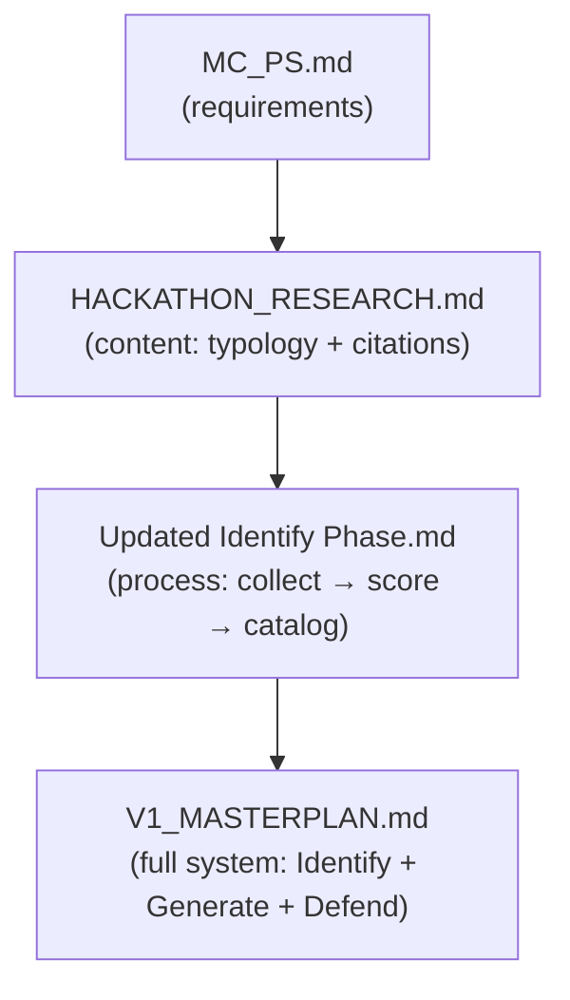
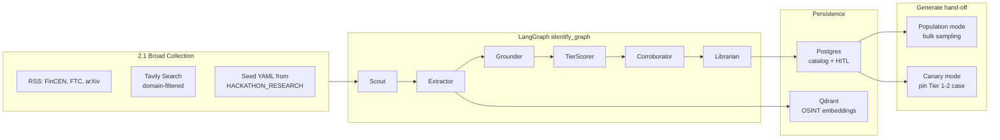

# Identify Pipeline Implementation Plan

## How the documents fit together

The repo is currently **docs-only** (no `packages/` yet). The four planning docs form a stack:




| Document                                                   | Role in implementation                                                                                                                |
| ---------------------------------------------------------- | ------------------------------------------------------------------------------------------------------------------------------------- |
| [MC_PS.md](MC_PS.md)                                       | Judges' rubric: breadth/depth, closed loop, web UI                                                                                    |
| [HACKATHON_RESEARCH.md](HACKATHON_RESEARCH.md)             | **Content seed** — Section 3 lifecycle taxonomy and typology catalog (≈ the `research_brief.md` referenced in Updated Identify Phase) |
| [Updated Identify Phase.md](Updated%20Identify%20Phase.md) | **Process contract** — single pipeline, tier scoring, corroboration rules, catalog schema, canary hand-off to Generate                |
| [V1_MASTERPLAN.md](V1_MASTERPLAN.md)                       | **Build contract** — repo layout, agents, stores, build order, Tavily tooling                                                         |


**Key reconciliation:** Updated Identify Phase defines *what* the catalog row must contain (`source_tier`, `confidence_level`, `corroboration_type`, `simulatable_signals`, `canary_eligible`). V1_MASTERPLAN defines *how* to build it (`AttackSpec` Pydantic model, Scout/Extractor/Grounder/Librarian agents, Qdrant, HITL). Implementation merges both into one schema and one `identify_graph`.

**Doc fix needed:** Section 2.3 table in [Updated Identify Phase.md](Updated%20Identify%20Phase.md) is corrupted (two vector classes merged into one row). Restore the intended two-row table before coding corroboration logic.

---

## End-to-end Identify architecture




Pipeline stages from Updated Identify Phase map directly to code modules:


| Stage                       | Package / agent                          | Deterministic vs LLM                                               |
| --------------------------- | ---------------------------------------- | ------------------------------------------------------------------ |
| Broad collection            | `packages/osint/` fetchers + Scout       | Scout uses LLM to phrase queries; fetch is deterministic allowlist |
| Source-tier scoring         | `TierScorer` node (new)                  | **Deterministic** — domain → tier lookup table                     |
| Type-specific corroboration | `Corroborator` node (new)                | **Deterministic** — rules + optional telemetry API calls           |
| Structured catalog entry    | `Extractor` + `Librarian` + `AttackSpec` | LLM extracts JSON; Pydantic validates                              |
| Canary validation           | `packages/sim/` injector **canary mode** | Runs in Generate, not Identify                                     |


---

## Unified catalog schema

Extend V1's `AttackSpec` ([V1_MASTERPLAN.md §6.3](V1_MASTERPLAN.md)) with Identify Phase fields. One model serves Postgres, YAML seed, and Generate:

```python
# packages/catalog/models.py (conceptual merge)
class AttackSpec(BaseModel):
    # Identity
    vector_id: str
    name: str                    # was: title
    one_liner: str | None = None

    # Taxonomy (from both docs)
    rail: Rail                   # card_cnp | a2a_rtp | upi_like | onboarding | ...
    genai_modality: Modality     # text | voice | video | document | bot | mixed
    lifecycle_stage: Lifecycle   # align HACKATHON_RESEARCH §3.1 kill-chain
    control_bypassed: list[str]  # was: failed_control
    actor_type: Literal["consumer", "merchant"]

    # Identify Phase scoring (NEW)
    source_tier: int             # 1-5
    confidence_level: Literal["confirmed", "reported-unverified"]
    corroboration_type: Literal["network-telemetry", "documentary-case", "not-yet-corroborated"]
    source_urls: list[str]       # best-tier first; was: citations

    # Generate hand-off (NEW + existing)
    simulatable_signals: dict    # concrete fields for injectors
    canary_eligible: bool
    simulator: SimulatorRef      # injector_id + param_schema (from masterplan)
    features_expected: list[str]

  status: proposed | approved | rejected
```

Map HACKATHON_RESEARCH Section 3 typology entries → seed YAML with `status: approved`, pre-filled `source_tier` and `canary_eligible` where FinCEN/arXiv citations exist (e.g. Hong Kong deepfake CFO, FinCEN FIN-2024-Alert004 patterns).

---

## Tooling: Tavily yes, Firecrawl optional fallback

### Primary stack (locked in V1_MASTERPLAN §6.2)


| Job                   | Tool                                            | Why it fits Updated Identify Phase                                                                 |
| --------------------- | ----------------------------------------------- | -------------------------------------------------------------------------------------------------- |
| Discover new articles | **Tavily Search** with `include_domains`        | Domain-filtered broad collection without illicit crawl; matches "cast a wide net" within allowlist |
| Extract article text  | **Tavily Extract** or `httpx` + **trafilatura** | Single-URL fetch for regulatory/vendor sources                                                     |
| Known feeds           | **feedparser** (FinCEN, FTC, arXiv API)         | Tier-1 sources without search API cost                                                             |
| Dedup / RAG           | **sentence-transformers** + **Qdrant**          | Librarian cosine dedup (>0.92 reject per masterplan)                                               |
| Structured extraction | Groq/Ollama + Pydantic                          | Article → `AttackSpec` JSON with retry on validation fail                                          |
| Offline demo          | Cached fixtures in `data/osint/`                | `IDENTIFY_LIVE_SEARCH=false` per masterplan §12.2                                                  |


### Firecrawl — use only as fallback, not primary

Firecrawl (`scrape` / `crawl`) is viable for **single-URL markdown extraction** on allowlisted domains when Tavily quota is exhausted or a page blocks trafilatura. It is **not** a good primary choice because:

- Updated Identify Phase and V1 both reject unrestricted crawling; Firecrawl's `crawl` strength is site-wide discovery — redundant with Tavily Search + domain filter and adds ToS/engineering risk.
- Tavily is already agent-shaped (search + extract + optional Research API with `output_schema`) and integrated in the masterplan's LangChain path.
- Adding Firecrawl means a second API key, second billing surface, and duplicate extract logic for marginal gain.

**Recommendation:** Ship v1 with **Tavily + trafilatura + RSS**. Add Firecrawl behind a feature flag (`OSINT_EXTRACTOR=firecrawl`) only if demo rehearsals hit extraction failures on specific allowlisted URLs.

### What Tavily does *not* cover

Network telemetry corroboration (GreyNoise, Shadowserver, DShield) is **not** a search tool — add thin API clients in `packages/osint/telemetry/` called by the `Corroborator` node for `network-footprint` vectors only. Human/social-engineering vectors skip telemetry and rely on tier rules alone.

---

## LangGraph `identify_graph` nodes

Implement in [packages/agents/](packages/agents/) per V1 §4.2, extended with two deterministic nodes from Updated Identify Phase:

### 1. Scout

- Input: optional query topic (e.g. "deepfake KYC payments")
- Calls: RSS poll + Tavily Search (`include_domains`: fincen.gov, feedzai.com, arxiv.org, reuters.com, …)
- Output: `candidate_urls[]` with `source_domain`, `snippet`, `fetched_at`
- Safety: never query dark-web / criminal-market terms

### 2. Extractor

- Fetch body via Tavily Extract or trafilatura
- LLM → partial `AttackSpec` candidates (temperature ≤ 0.2, structured output)
- Store raw chunk + embedding in Qdrant (`{url, date, source_type}`)

### 3. Grounder (deterministic rules, light LLM optional)

Reject if: no payment rail, GenAI buzzword only, no `control_bypassed`, duplicate title+rail embedding > 0.92, exploit-step detail (keep high-level typology only).

### 4. TierScorer (NEW — deterministic)

```python
DOMAIN_TIER = {
  "fincen.gov": 1, "ftc.gov": 1, "rbi.org.in": 1,
  "arxiv.org": 2, "dhs.gov": 2,
  "feedzai.com": 3, "wipro.com": 3, "deloitte.com": 3,
  "reuters.com": 4, "bbc.com": 4,
}
# confidence_level:
#   confirmed if any source tier <= 2 alone
#   OR >= 2 independent sources at tier <= 3
#   else reported-unverified
```

### 5. Corroborator (NEW — deterministic + optional APIs)

- Classify vector as `network-footprint` vs `human-social` (rule-based on `genai_modality`, `lifecycle_stage`, `control_bypassed`)
- Network-footprint: optional GreyNoise/Shadowserver lookup → set `corroboration_type = network-telemetry` if signal found
- Human-social: set `corroboration_type = documentary-case` when tier rules confirm; never claim honeypot validation
- Set `canary_eligible = True` only when `confidence_level == confirmed` and best `source_tier <= 2`

### 6. Librarian

- Merge with existing catalog (Postgres); bump depth on duplicates
- Route `status: proposed` → **HITL interrupt** (masterplan §2 workflow step 2: "Run Identify → Approve")
- On approve → `status: approved`, visible on Threat map UI

---

## Integration with Generate and Defend

Updated Identify Phase §4 defines the output contract. Wire in `packages/sim/`:


| Mode           | Trigger                                        | Behavior                                                                                                                                                                  |
| -------------- | ---------------------------------------------- | ------------------------------------------------------------------------------------------------------------------------------------------------------------------------- |
| **Population** | Default sim run                                | Sample `approved` catalog entries weighted by rail/family; Injector reads `simulatable_signals` + `simulator.injector_id`                                                 |
| **Canary**     | UI button or `sim --mode canary --vector-id X` | Pin all attack parameters to one `canary_eligible` entry (e.g. FinCEN deepfake-KYC → seasoning → APP credit → crypto cash-out); log detection outcome per lifecycle stage |


Canary validation is **not** an Identify node — it is a Generate subgraph mode that consumes `canary_eligible` + `simulatable_signals` and reports back to the co-evolution loop (Updated Identify Phase §2.5).

Defend reads the ledger produced by Generate; Identify never touches the scorer.

---

## Build sequence (aligned with V1 §15)

Do not start with agents. Follow masterplan order, inserting Identify Phase specifics at the marked steps:

1. **Pydantic `AttackSpec` + seed YAML** — hand-transcribe 25–40 vectors from [HACKATHON_RESEARCH.md §3](HACKATHON_RESEARCH.md) with tiers and citations pre-filled.
2. **World sim + 3 injectors** (APP, mule, CNP) — prove `simulatable_signals` schema works.
3. **Features + LightGBM + metrics** — closed loop skeleton exists.
4. **LangGraph Identify on fixtures** — FinCEN alert text checked into `data/osint/fixtures/`; no live API.
5. **Tavily allowlist + Qdrant + HITL** — live collection; TierScorer + Corroborator nodes.
6. **Canary mode in Generate** — one FinCEN-pinned case end-to-end.
7. **Co-evolve + UI Threat map** — approved catalog drives diversity score.

---

## Demo story (six clicks, unchanged from V1 §2.1)

1. Threat map shows 20+ **approved** vectors with `confidence_level` badges and `source_tier` chips.
2. Run Identify on a fresh FinCEN/RBI alert → Scout/Extractor propose 1–3 vectors → HITL Approve.
3. Simulate generation N (population mode).
4. Run **canary case** for one Tier-1 vector → show detector catch/miss at each lifecycle stage.
5. Arms race chart across generations.
6. Retrain from misses.

---

## Environment and safety

`.env.example` additions beyond V1:

- `TAVILY_API_KEY` (required for live Identify)
- `GREYNOISE_API_KEY` (optional, telemetry corroboration)
- `IDENTIFY_LIVE_SEARCH=false` (airplane mode)
- `OSINT_EXTRACTOR=tavily|trafilatura|firecrawl` (optional fallback)

Hard limits (both docs): no dark web, no criminal LLM calls, no live honeypots, no scam-bait content. Identify = public typology research only.

---

## Summary: Tavily vs Firecrawl for this project


| Criterion                    | Tavily      | Firecrawl                                |
| ---------------------------- | ----------- | ---------------------------------------- |
| Domain-filtered agent search | Native      | Not primary use case                     |
| Single-URL extract           | Extract API | Scrape API (good fallback)               |
| Fits allowlist-only policy   | Yes         | Only if limited to `scrape`, not `crawl` |
| Already in masterplan        | Yes         | No                                       |
| v1 recommendation            | **Primary** | **Optional extract fallback only**       |


Use Tavily for the Identify pipeline. Keep Firecrawl in reserve for stubborn allowlisted pages; do not build the architecture around site crawling.