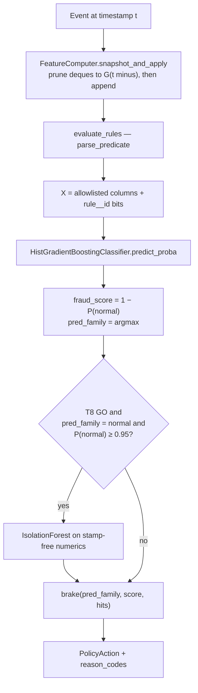
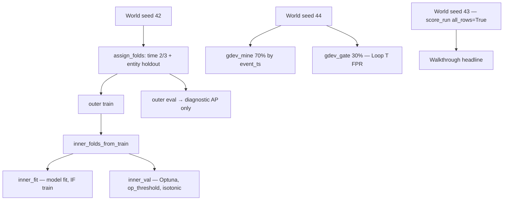
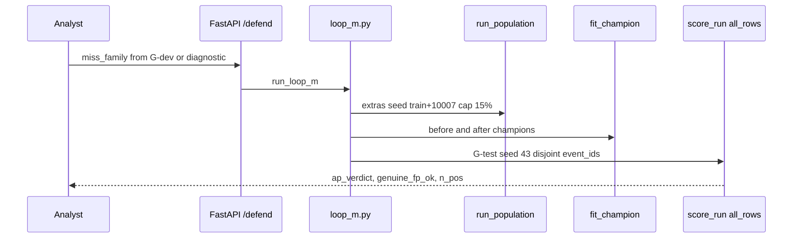

# AegisLoop Defend — technical architecture note

**System:** AuthGate (Defend) inside AegisLoop, Mastercard Innovation Challenge @ GFF 2026  
**Companion files:** start — [`README-defend.md`](README-defend.md); code — [`defend-execution-ssot.md`](defend-execution-ssot.md); tests — [`defend-test-tracker.md`](defend-test-tracker.md); meaning — [`defense-architecture.md`](defense-architecture.md); rationale — [`defense-why.md`](defense-why.md); gates — [`VALIDATION.md`](../../VALIDATION.md).  
**If numbers or ticket order disagree, `defend-execution-ssot.md` §13 wins.**  
**Stack (live today):** Python 3.11+, pandas / PyArrow parquet, scikit-learn `HistGradientBoostingClassifier`, PyYAML rule table, FastAPI, joblib artifacts. Identify uses LangGraph; **Defend does not.**

---

## 1. What Defend is

AegisLoop is a laboratory closed loop: **Identify** a threat census, **Generate** a UPI-shaped synthetic world, **Defend** at authorization time. The problem statement asks for detect, **flag**, and **mitigate**. Those three verbs are three modules, not one binary classifier.

| Verb | Module | Artifact |
|------|--------|----------|
| Detect | Multiclass histogram gradient boosting | `models/<run_id>/champion.joblib` |
| Flag | Nine live YAML predicates + reason codes | `data/rules/v0_rules.yaml` |
| Mitigate | Deterministic Brake table | `packages/eval/brake.py` |

The economic objects are **families**, not technique ids. A coerced authorized-push payment (APP) is not account takeover (ATO), which is not a mule soak. A single `decline` for all three either punishes the victim or leaves the mule’s credit open. Brake encodes that typology in code, not in a prompt.

**Honest taper (do not inflate on slides):**

| Layer | Count | Implementation |
|-------|------:|----------------|
| Identify taxonomy | 24 | `TechniqueId` T01–T24 in Postgres catalog |
| Seed AttackSpec rows | 29 | duplicates exist; census is 24 ids |
| Injector engines | 4 | `graph_mule`, `identity_trajectory`, `app_session`, `doc_beneficiary` |
| `label_family` | 6 | `normal`, `mule`, `identity_burst`, `ato`, `app_fraud`, `invoice_fraud` |
| Live rules | 9 | list-root YAML, `status: live` |
| Champion | 1 | `sklearn.ensemble.HistGradientBoostingClassifier` |

Coverage cell `live_rule` means **predicate field-name overlap** with `features_expected`, via `COVERAGE_EQUIV` in `packages/policy/rules.py`. It is not a measured fire-rate on that technique’s traffic.

---

## 2. Lab topology

Identify produces catalog cards. Default Generate **does not** consume those recipes unless `vector_id` is passed; the population mix is `DEFAULT_SIGNALS` in `packages/sim/inject/mix.py`. Features are rebuilt with a single forward pass over time-ordered events (`FeatureComputer`, O(number of events), deque windows). Defend scores parquet. Feedback never writes into the G-test world.

```mermaid
flowchart LR
  subgraph identify [Identify — LangGraph]
    Scout --> Curator --> Extractor --> Grounder --> TierScorer --> Corroborator --> Librarian
    Librarian --> HITL[HITL approve / reject / edit]
  end
  subgraph generate [Generate — ShadowRail]
    Quiet[Quiet Poisson world<br/>priors.json]
    Mix[apply_mix — 4 injectors]
    Feat[FeatureComputer G(t minus)]
    Fid[PSI / fidelity gate]
    Quiet --> Mix --> Feat --> Fid
    Fid --> P42[train.parquet world_seed 42]
    Fid --> P43[G-test parquet world_seed 43]
    Fid --> P44[G-dev parquet world_seed 44]
  end
  subgraph defend [Defend — no graph]
    R[v0 YAML rules]
    HGB[HistGradientBoostingClassifier<br/>y = label_family]
    IF[IsolationForest notify<br/>off until T8]
    Br[Brake]
    R --> HGB --> IF --> Br
  end
  HITL -.->|Loop I draft dict| R
  HITL -.->|Loop C coverage map| Map[24-cell coverage]
  P42 --> HGB
  P43 -.->|photograph only| Score[score_run all_rows=True]
  P44 -.->|Loop T mine/gate| T[DecisionTreeClassifier]
  T -.->|HITL approve| R
  Br -.->|miss family not from 43| M[Loop M extra population]
  M --> P42
```

**Seeds (photographer protocol):**

| `world_seed` | Role |
|-------------:|------|
| 42 | Train world + `random_state` |
| 43 | Headline metrics; one shot per recipe hash |
| 44 | FN harvest, Loop T, ECE, permutation |
| 45 | Only if 43 was used for coaching |
| 42 + 10007 | Loop M extra mix (`packages/eval/loop_m.py`) |

---

## 3. Authorization-time path (one payment at time *t*)



### 3.1 Causal features — `packages/sim/features.py`

Windows are strict past: prune, snapshot, then append the current edge. After Ticket 1:

| Name | Definition |
|------|------------|
| `fan_in_1h` | Event count of inbound edges on the payee in the last hour |
| `fan_in_unique_payers_1h` | Distinct payer ids on those edges |
| `fan_out_1h` | Outbound event count on the payer |
| `burst_velocity` | Distinct outbound payees in 1h (**not** a copy of `fan_out_1h`) |
| `amount_vs_p30` | Amount / mean of payer amounts in 30 days |
| APP flags | Non-zero only on `app_fraud` rows in `train_rows()` |
| Invoice booleans | Copied from `ev["payload"]` into `features_auth` on replay |

`TRAIN_ALLOWLIST` / `TRAIN_DENYLIST` in `packages/sim/export.py` are the schema contract. Denylist includes `vector_id`, `technique_id`, `payload`, `gstin`, `world_seed`, `is_authorized_push`.

Invoice envelope flags after Ticket 1 are **stamps** on injector rows. Average precision on `invoice_fraud` then measures that stamp, not field BEC. Report it; do not call it production BEC skill. The same honesty applies to APP session flags (`call_active_flag`, `copy_paste_payee_flag`, `pause_ms`, `urgency_pressure`): `app_ablation` in `fit.py` refits without those columns.

### 3.2 Rules — `packages/policy/rules.py`

Predicates are value comparisons, not key presence: `field op value` with `op ∈ {==, !=, >=, <=, >, <}`. `FORBIDDEN_RULE_FIELDS` is enforced in `parse_predicate`. Kinds: `hard_flag`, `nudge`, `calm_down`. Live floor (ids): `call-and-paste-new-payee`, `new-payee-large-new-device`, `mule-fan-in-burst`, `invoice-beneficiary-swap`, `smurf-under-cap`, `rail-hop-burst`, `seasoning-burst`, `pause-paste-session`, `calm-down-known-usual-device`.

Rule hits become `rule__<id>` columns on the model matrix (`_attach_rule_bits` in `fit.py`). Loop I (`draft_rule_from_spec`) returns a dict; it does not write YAML.

### 3.3 Champion — `packages/eval/fit.py`

- **Estimator:** `sklearn.ensemble.HistGradientBoostingClassifier` (histogram GBDT; not LightGBM, not XGBoost, not AutoGluon on path).
- **Target:** `y = label_family` (six classes). Technique ids in `y` fail `build_matrix`.
- **Imbalance:** per-class `sample_weight` from `_class_weight` (inverse frequency). Not sklearn `class_weight=` on the estimator.
- **Recipe:** `models/features.json` — `max_depth=3`, `max_iter=80`, `learning_rate=0.08`, `random_state=42`. Ticket 3 sets `early_stopping=False` so sklearn’s `"auto"` early stop cannot hide a random holdout.
- **Split:** `time_cut_2_3_plus_entity_holdout` in `packages/eval/split.py` — calendar 2/3 train candidate, last 1/3 eval, plus mule-payee / customer entity holdout. Not `train_test_split(shuffle=True)`.
- **Operating point:** target genuine FPR `operating_point_fpr = 0.01`. After Ticket 3 the threshold is frozen on **inner-val** (last 20% of train calendar), then the model is refit on full outer train.
- **Family AP:** one-vs-rest `average_precision_score` on each class probability. It is a **metric**, not five pickled models.
- **HPO (Ticket 5, optional):** Optuna on inner-val only. Objective: binary AP minus `10 * max(0, genuine_fp - 0.01)`. Search: `max_depth ∈ {2,3,4,5}`, log `learning_rate`, integer `max_iter`. AutoGluon is write-up challenger only.

### 3.4 Isolation Forest (Ticket 8, off by default)

`sklearn.ensemble.IsolationForest` on stamp-free numerics (no APP flags, no invoice booleans, no `rule__*` bits). Trained on `inner_fit` rows with `label_family == normal`. Consulted only if `pred_family == "normal"` and `P(normal) ≥ 0.95`. Anomalous → `iso_notify`; Brake may upgrade **`allow` → `notify`** only. Never overrides `mule_credit_restrict`, `hold`, `decline`, `step_up`. If genuine notify rate on inner-val exceeds 0.05, keep IF disabled. IF does not change named-gap cells.

### 3.5 Brake — `packages/eval/brake.py`

Priority (code order):

1. Mule family or mule `applies_to` → `mule_credit_restrict` (payee credit, not last-sender slap).
2. `calm_down` and no `hard_flag` → `allow` (kirana / rent shape).
3. APP → `hold` if hard flag or `score ≥ 0.65`, else `notify`. Final clamp: APP never `decline`.
4. Invoice / BEC → `hold` or `case`.
5. ATO → `decline` if hard or `score ≥ 0.5`, else `step_up`.
6. `identity_burst` → `step_up` or `notify`.
7. Else elevated score → `notify`; else `allow`.

LLM may format case-tab prose from `reason_codes`. It does not choose the action.

---

## 4. Nested evaluation (why G-test is not a tuning set)



Triple-dip is forbidden: Optuna does not share a fold with Loop T. Loop T uses a **separate world** (44), then splits that world into mine vs gate so FPR is not measured on the tree’s own negatives.

---

## 5. Closed loops

| Loop | Code | What it does | What it does not do |
|------|------|----------------|---------------------|
| **I** | `packages/policy/loop_i.py`, `POST /defend/loop-i/draft/{vector_id}` | Catalog card → draft rule or `named_gap` | Write YAML; auto-promote |
| **C** | `packages/policy/coverage.py`, `GET /defend/coverage-map` | 24 cells: `live_rule` / `named_gap` / `case_only` | Claim 24 detectors |
| **M** | `packages/eval/loop_m.py`, `POST /defend/loop-m` | Extra family mix on train copy; refit; score seed 43; `catalog_solved: false` | Knob search; Atlas writes; extras on G-test |
| **T** | Ticket 7: `loop_t.py` + `rule_hitl.py` | `DecisionTreeClassifier` (depth 3) on G-dev FNs → `parse_predicate` paths → HITL | LLM-chosen thresholds; auto-on rules |
| **G** | — | — | **Not built.** Do not demo it. |



Loop T HTTP this sprint (four routes): `POST /defend/loop-t/mine`, `GET /defend/rules/drafts`, `POST /defend/rules/approve/{id}`, `POST /defend/rules/reject/{id}`. Versioning: YAML remains a **list** (`load_v0_rules` requires a list); backups under `data/rules/backups/`. LLM, if used, returns `{id, reason}` only; `when` must equal the tree export.

**Caught definition for mining** is detection residual: family positive and not (`score ≥ op_threshold` or any `hard_flag`). That is not Brake-action FN (mule restrict can fire on predicted family with a low score).

---

## 6. Metrics the walkthrough may quote

Headline blob: `score_run(..., all_rows=True)` on `make-gtest`, `world_seed = 43`. Same-run outer eval is `diagnostic_*`.

| Key | Meaning |
|-----|---------|
| `ap_by_family` | OVR average precision |
| `n_pos` | Support; `not_comparable` if fraud n_pos < 30 |
| `genuine_fp` | FPR on `label_family == normal` at frozen threshold |
| `tpr_at_fpr` | TPR at genuine FPR 0.001 / 0.005 / 0.01 |
| `f1_at_op` | F1 at the 1% FPR operating point |
| `app_ablation` | With vs without session flags; G-test copies champion-fit ablation (`app_ablation_source`) |
| `mule_entity_recall` | Fraction of gold mule payees with ≥1 inbound flagged |
| `authgate_ms` | In-process `predict_proba` p50 / p99 / 1k-row batch (laptop, not issuer SLA) |
| `action_histogram` | Brake counts |
| `expected_cost` | Lab weights (miss 10, notify 1, hold 3, decline 8) — not rupees, not India prevalence |
| Loop M | `gtest_before` / `gtest_after`; miss family **not** chosen from 43; Loop M FPR slack **0.02** |
| Loop T | proposed / rejected / approved; gate FPR **0.002** (different epsilon) |

Do not collapse the two FPR epsilons. Do not quote CI `n_customers=20` as the submission number (Plan 08 is 2400 × 120 × 90).

---

## 7. Named gaps (correct answers, not missing slides)

| Id | Name | Why payment-time Defend cannot close it |
|----|------|----------------------------------------|
| T06 | Synthetic merchant collusion | No merchant-settlement graph in the sim |
| T07 | Card / BIN testing | No card-auth rail or BIN field |
| T20 | Invoice-timed impersonation | Dual channel; no telephony rail |
| T21 | Voice-clone BEC | No audio; beneficiary swap is the only envelope tell |
| T22 | Detector evasion (Cat 4) | Offline; no public `/attack` |
| T23 | Training-data poisoning (Cat 4) | Trust-tier / offline, not population inject |

Isolation Forest does not close these. It only flags unusual **stamp-free** `G(t−)` vectors as `notify`.

---

## 8. Feasibility and refusals

**Feasible on a laptop:** YAML + histogram GBDT + Brake; joblib load; FastAPI `POST /defend/fit` and `/defend/score`. LLM is off the scoring path (inspect `apps/api/routes/defend.py`).

**Refused as live claims:** five family models; AutoGluon / FLAML on the demo path; GNN at auth; Featuretools DFS on the event log; CaseScore LLM on the payment; auto-`solved`; auto-promote rules; nine production loops; “this is live UPI”; beating Mastercard production latency SLAs.

Novelty is the **loop you can click** (miss → Generate extra → refit → new-seed photograph) plus typed mitigation and HITL rules — not a leaderboard bake-off.

---

## 9. Where to go next

| Document | Role |
|----------|------|
| [`defend-execution-ssot.md`](defend-execution-ssot.md) | Tickets, frozen constants, test names |
| [`defend-test-tracker.md`](defend-test-tracker.md) | Unit / ML / HTTP / Generate→Defend matrix |
| [`defend-dev-keepinminds.md`](defend-dev-keepinminds.md) | Leakage and honesty checklist |
| [`MC_PS.md`](../../MC_PS.md) | Judging axes |

Build order: honesty floor (invoice columns + unique degree) before any invoice AP quote; nested protocol before Optuna; Loop T after frozen `op_threshold`; Isolation Forest only if genuine notify rate stays under the abort gate.
