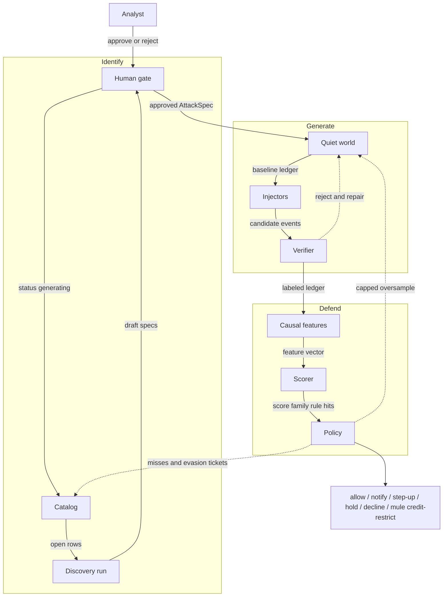
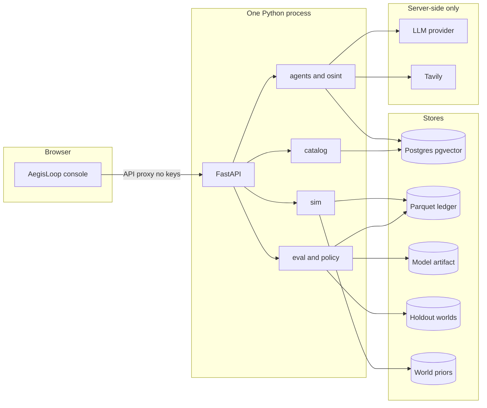
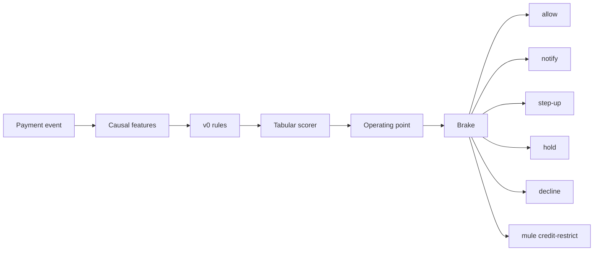
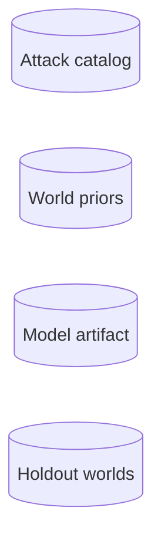

# AegisLoop — system architecture

Mastercard Innovation Challenge @ GFF 2026 · AI Defense Lab for Payment Security

One lab, three jobs, one loop: **identify** emerging GenAI payment attacks, **generate** them as a labeled payment tape, **defend** with a score and an action. Misses return as work. They do not re-grade the same holdout.

This is a research lab, not a live rail. Parties are synthetic (`VID-SIM-…`). The prototype is still shaped like an issuer/network decisioning service: causal features at payment time, latency on the authorization path, a genuine false-positive cap, and a policy action — not a class label.

Detail: [`Docs/ARCHITECTURE.md`](../Docs/ARCHITECTURE.md) · product jobs: [`MC_PS.md`](../MC_PS.md) · one-page brief: [`SYSTEM-OVERVIEW.md`](SYSTEM-OVERVIEW.md).

---

## 1. Closed loop

The product question: *how do the three pillars close?*

Primary flow is left to right inside each lane, then down the right edge. The return path is the only dashed stroke. It re-enters Identify and Generate as tickets or capped oversample — never as a silent weight update.

**Boxes**

| Box | What it emits |
|---|---|
| Catalog | 24 techniques, five categories, generate or name-only |
| Discovery run | Collect, extract, rank, ground in payment rails |
| Human gate | AttackSpec in, approved row out |
| Quiet world | Personas, caps, circadian spend, known payees |
| Injectors | Four families as perturbations of the quiet world, not a glued-on file |
| Verifier | Rail rules in code; accept or bounded repair |
| Causal features | At payment time *t*, edges before *t* only, no future |
| Scorer | Tabular GBDT, family probabilities, fraud score |
| Policy | Operating point at a genuine-FPR cap; six actions |

**What moves on the arrows**

| From to | Artifact |
|---|---|
| Catalog to Discovery | Open technique rows T01-T24 |
| Discovery to Human gate | Draft `AttackSpec`: rail, lifecycle, economic class, citations, feature contract |
| Human gate to Quiet world | Approved spec. Code generation is capability-limited; naming may still be exhaustive |
| Quiet world to Injectors | Baseline `gff.txn.v1` ledger, genuine circadian spend first |
| Injectors to Verifier | Candidate fraud events as perturbations: APP, ATO, mule, invoice |
| Verifier to Causal features | Accepted labeled ledger. Seed recorded. Fidelity gate must pass |
| Causal features to Scorer | Feature vector from edges strictly before *t* |
| Scorer to Policy | Score, predicted family, rule-hit bits |
| Policy to Catalog / Quiet world | Misses that survive a holdout: tickets or capped oversample. Promote only if independent holdouts do not get worse |

Thresholds are chosen on training inner validation. The held-out test world is scored once. Retrain that lifts recall by flooding genuine traffic with friction is a reject.

---

## 2. Runtime

One Python process. The browser talks to FastAPI. Keys stay server-side. There is no live NPCI, issuer host, or production payment API.

| Layer | Location | How it runs |
|---|---|---|
| Console | `frontend/` | Vite on port 5173, proxies `/api` to port 8000 |
| API | `apps/api/` | FastAPI. Catalog, Identify, Generate, Defend routes |
| Identify | `packages/agents/`, `packages/osint/` | LangGraph pipeline inside the API process |
| Generate | `packages/sim/` | Seeded quiet world plus injectors. LLM does not write rupees or mule edges |
| Defend | `packages/eval/`, `packages/policy/` | Causal features, then rules, then GBDT, then Brake |
| Catalog | `packages/catalog/`, `data/catalog/seed.yaml` | 24 techniques, five categories, generate vs name-only |
| Database | Docker Postgres plus pgvector | Host port 5433. No separate vector DB |

LLM is used for Identify extract and curator only. Never on authorization. Tavily is allowlisted OSINT for live Identify only.

---

## 3. One payment, at time *t*

Language models are off this path. Rules fire first. The model sees which rules hit. Brake maps score plus family plus rules to an action. APP gets warn / hold / step-up on a new payee, not a silent decline of a known one. Mule action restricts **credit** on the payee, not only the sender.

| Step | What it does |
|---|---|
| Payment event | Amount, parties, timestamp, rail |
| Causal features | Velocity, timing, graph-lite, amount, session flags. Edges before *t* only |
| v0 rules | Hard flags, nudges, calm-downs. Model sees which rules hit |
| Tabular scorer | HistGradientBoosting. Family probabilities. Fraud score is 1 minus P-genuine |
| Operating point | Threshold chosen on train only, under a genuine-FPR cap |
| Brake | Deterministic policy table, not a second model |

Target story: **50-300 ms** on the authorization path. Case-level text (chat, invoice narrative) is investigation, not a payment dependency.

---

## 4. Pillars — what each must emit, and must not do

| | Identify | Generate | Defend |
|---|---|---|---|
| **Job** | Breadth and depth. Map novel GenAI payment fraud across channels, rails, and social-engineering surfaces. Ground each idea in how payments work. | Simulate those attacks at scale. Synthetic traffic must look like a payment tape. | Detect, flag, and mitigate. Maximise recall on the simulated attacks. Keep false positives on genuine payments low. |
| **Emits** | Machine-readable `AttackSpec`: technique, rail, lifecycle stage, economic class, generate vs name-only, citations, feature contract. | Labeled event ledger `gff.txn.v1`. Quiet life first, then constrained fraud. Seed recorded. Fidelity gate. | At event time *t*: score, family, reason codes, **policy action**. |
| **Must not** | Dark-web scrape, exploit write-ups, a second informal taxonomy. | Let an LLM write rupees or mule edges. Copy production rows. Glue a fraud CSV onto random amounts. Put VPA + 3DS + GSTIN + chat embedding on every row. | Put an LLM on authorization. Train on the batch just oversampled. Report accuracy on a balanced mix. Silent-decline authorised push payments the way one declines stolen-credential traffic. |

Identify stores 24 techniques (T01-T24) in five structural categories — network, identity, social/APP, model-targeted, document. Card / 3DS / network vectors are **named** even when the simulator stays UPI-structured.

Generate pattern: proposer (structured params) to engine (code) to verifier (accept or bounded repair). Only code may accept a sample.

---

## 5. Stores

Four durable places. The loop may read them all. Only the catalog and the quiet world accept new *work* from misses. The holdout world is scored, not searched.

| Store | Holds | Written by | Read by |
|---|---|---|---|
| Attack catalog | Postgres, technique cards, citations | Identify plus analyst promote | Generate eligible specs, console threat map |
| World priors | Amount/hour mixes, personas, caps | Generate calibrator | Quiet-world sampler |
| Model artifact | Frozen weights, threshold from train only | Defend fit on the train world | Defend score; never mutated from holdout |
| Holdout worlds | Scored once, never used to pick the threshold | Generate on a separate seed | Defend eval once per experiment |

---

## 6. What this is not

- Not live UPI. Not NPCI. Not an issuer host.
- Not an LLM on the authorization path.
- Not a self-scoring loop: the test world is never used to choose the threshold.
- Not detection without an action. The product is Brake, not a class label.

Lab prototype for GFF 2026. Detection without an action is not the product.
